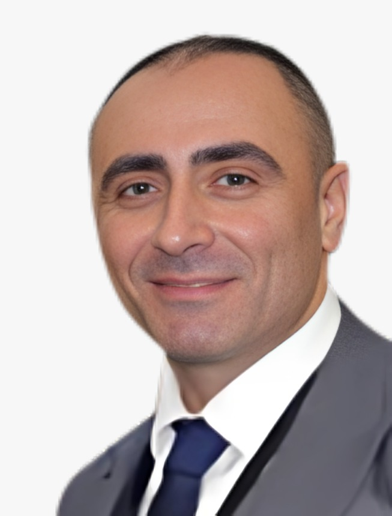
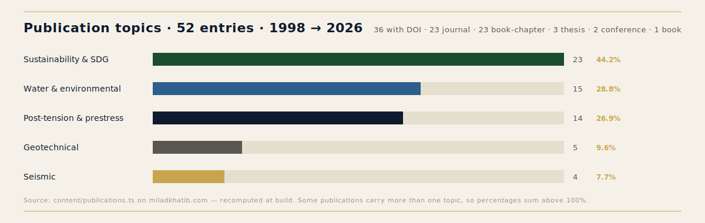
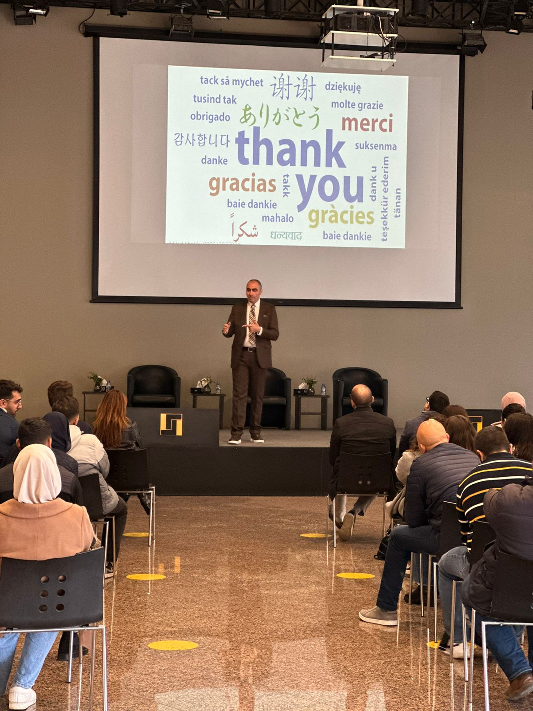
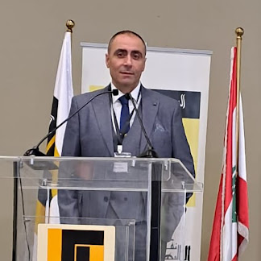
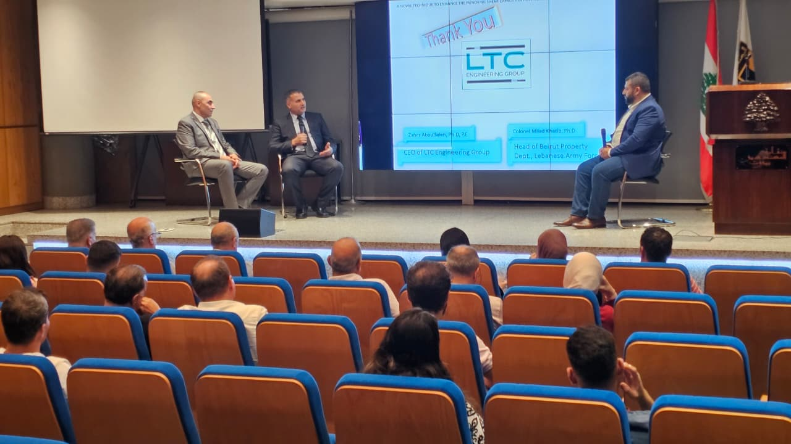
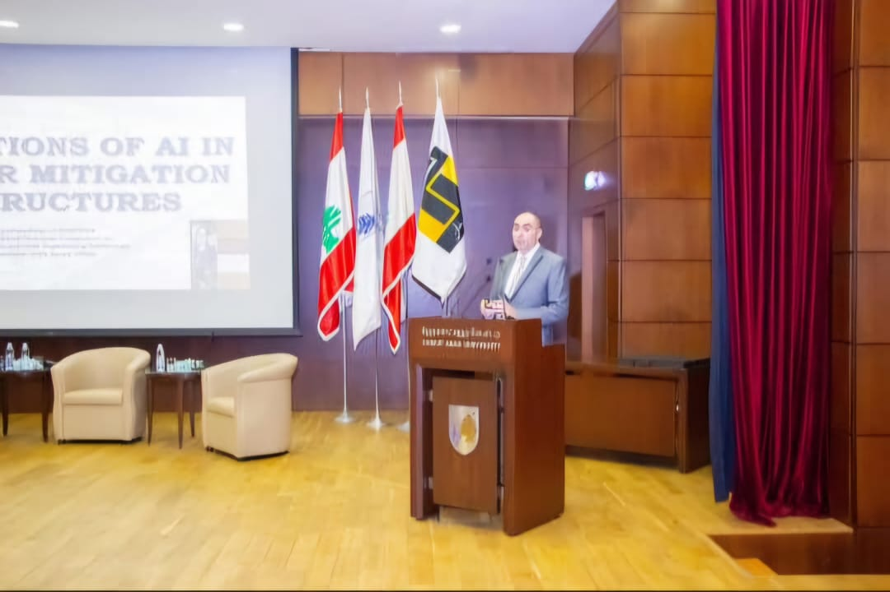
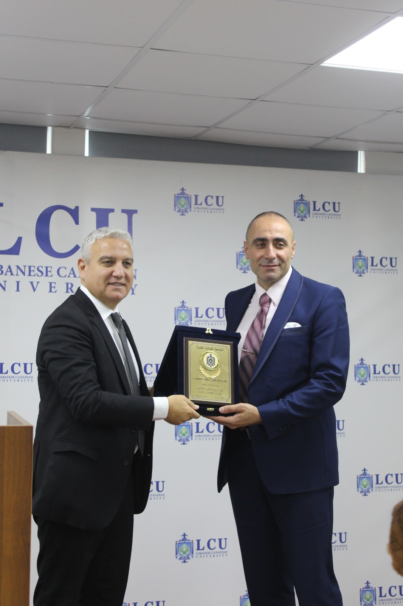
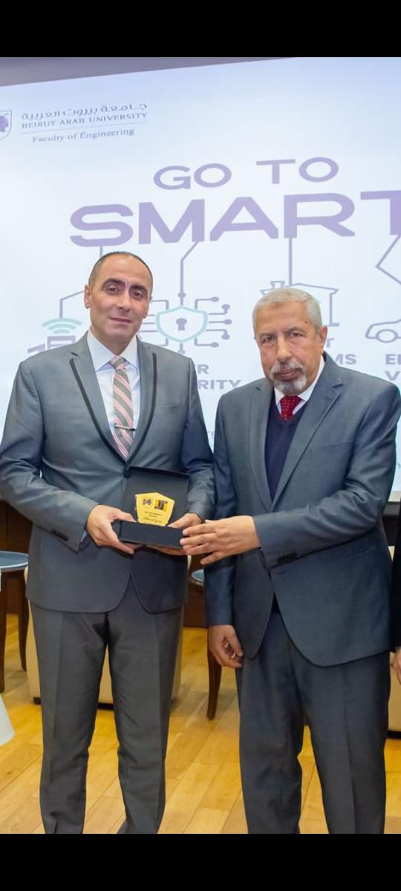
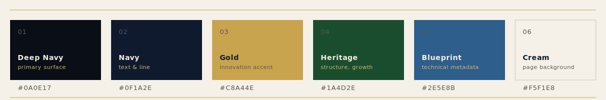

<div align="center">

<br/>


<br/>
<br/>

# Dr. Milad Khatib · د. ميلاد الخطيب

### Civil Engineering Consultancy · الاستشارات الهندسية المدنية

**_Engineering by proof._** &nbsp;·&nbsp; **_الهندسة بالبرهان._**

<br/>

[](https://orcid.org/0000-0002-0140-0941)
[](https://www.scopus.com/authid/detail.uri?authorId=57202890131)
[](https://scholar.google.com/citations?user=rZQRkikAAAAJ)
[](https://www.researchgate.net/profile/Milad-Khatib)

[](#publications)
[](#publications)
[](#patents)
[](#editorial)
[](#trajectory)
[](#languages)

<br/>

[](https://miladkhatib.com)
[](https://www.oea.org.lb)
[]()

<br/>

</div>

> **PhD · Eng. · Assistant Professor (Lebanese International University) · MBA Candidate (AUST)**
>
> Solo civilian engineering consultancy combined with three concurrent academic posts. Twenty‑seven years of structural, geotechnical, and forensic practice in the Lebanese context — fifty‑two peer‑reviewed publications, two Lebanese‑registered patents, one published book, and twenty‑one journal editorial seats. Bilingual practice. Numbers carry the argument.

<br/>

---

## 📜 Table of Contents

| | | |
|:--|:--|:--|
| 01 &nbsp;[Position](#position) | 05 &nbsp;[Patents](#patents) | 09 &nbsp;[Appearances](#appearances) |
| 02 &nbsp;[Three Pillars](#pillars) | 06 &nbsp;[Publications](#publications) | 10 &nbsp;[Languages](#languages) |
| 03 &nbsp;[Trajectory](#trajectory) | 07 &nbsp;[Editorial &amp; Peer Review](#editorial) | 11 &nbsp;[Distinctions](#distinctions) |
| 04 &nbsp;[Education](#education) | 08 &nbsp;[Speaking](#speaking) | 12 &nbsp;[Connect](#connect) |

<br/>

---

<a id="position"></a>

## ◆ &nbsp; Position

<table>
<tr>
<td width="32%" valign="top" align="center">



<sub>Beirut · 2026</sub>

</td>
<td width="34%" valign="top">

### English

A Beirut‑based civil engineering practice that pairs senior consultancy with an active academic and research record. The practice operates at the intersection of three disciplines — **structural design**, **geotechnical analysis**, and **forensic engineering** — for Lebanese ministries, municipalities, water authorities, contractors, developers, and the insurance and legal sectors that commission expert‑witness work.

The consultancy is supported by a dedicated research stream: fifty‑two peer‑reviewed publications, two registered patents, twenty‑one editorial board appointments across journals in the Americas, Europe, the UK, and Asia, and concurrent supervisory posts at the Lebanese International University, the University of Balamand, and ISSAE‑Cnam Liban.

> _"Engineering by proof."_ &nbsp;— every claim, every credential, every date, every DOI on the public record is traceable to a source.

</td>
<td width="34%" valign="top">

### العربية

ممارسة هندسية مدنية مقرّها بيروت تجمع بين الاستشارات الهندسية الكبرى وسجلٍّ أكاديمي وبحثي نشِط. تعمل الممارسة عند تقاطع ثلاثة تخصّصات — **التصميم الإنشائي**، و**التحليل الجيوتقني**، و**الهندسة الجنائية** — للوزارات والبلديات وسلطات المياه اللبنانية، وللمقاولين والمطوّرين، ولقطاعَي التأمين والقانون اللذين يكلّفان بأعمال الخبرة في النزاعات.

تُدعَم الاستشارات بمسارٍ بحثي مستقل: 52 منشوراً علمياً محكَّماً، وبراءتا اختراع مسجَّلتان، و21 تعييناً في هيئات تحرير مجلات في الأمريكتين وأوروبا والمملكة المتحدة وآسيا، ومناصب إشراف بحثي متزامنة في الجامعة اللبنانية الدولية وجامعة البلمند ومعهد ISSAE‑Cnam لبنان.

> _"الهندسة بالبرهان."_ &nbsp;— كل ادّعاء، وكل اعتماد، وكل تاريخ، وكل DOI في السجل العام يعود إلى مصدر يمكن التحقق منه.

</td>
</tr>
</table>

<br/>

---

<a id="pillars"></a>

## ◆ &nbsp; Three Pillars

<table>
<tr>
<th width="33%" align="center">🏛️&nbsp;&nbsp;Structural</th>
<th width="33%" align="center">⛰️&nbsp;&nbsp;Geotechnical</th>
<th width="33%" align="center">🔍&nbsp;&nbsp;Forensic</th>
</tr>
<tr>
<td valign="top">

Reinforced and prestressed concrete; post‑tensioned slab and beam systems; shear strength enhancement using inverted‑U‑shaped reinforcement (the subject of the published book and the doctoral programme); steel‑concrete composite behaviour; punching‑shear analysis.

</td>
<td valign="top">

Soil characterisation and foundation design; slope stability and retaining structures; drainage and irrigation systems; soil‑structure interaction; ground improvement techniques for the Lebanese geological context.

</td>
<td valign="top">

Failure analysis, expert‑witness reports, defect investigation for insurance carriers and law firms; root‑cause assessment of structural distress; technical reconstruction of construction events. Numbers, samples, and traceable methods only.

</td>
</tr>
</table>

<br/>

---

<a id="trajectory"></a>

## ◆ &nbsp; Trajectory

```
1998 ──● Bachelor, Civil Engineering · Beirut Arab University
        │
1999 ──● OEA Beirut · Order of Engineers and Architects · Member
        │
2005 ──● Master, Civil Engineering · Beirut Arab University
        │
2018 ──● PhD, Structural & Geotechnical Engineering · Beirut Arab University
        │   ↳ "Enhancement of Shear Strength of Prestressed Concrete
        │      Using Inverted U‑Shaped Reinforcement"
        │
2020 ──● Research Supervisor · ISSAE‑Cnam Liban
        │
2021 ──● Theory of Structures · Construction Management
        │   University of Balamand
        │
2022 ──● Research Supervisor · University of Balamand
        │
2023 ──● Geotechnical · Drainage & Irrigation · Construction Technology
        │   Lebanese International University
        │   ↳ Patent: Economic Vessel for Solid‑Waste Recovery in Waterways
        │
2024 ──● ICCEIC 2024 Keynote · China
        │   24 Hours of Concrete Knowledge · ACI · 1st Lebanese speaker
        │
2025 ──● Patent: Food‑Particle Collection Device
        │   Six new peer‑reviewed publications across geotech, seismic, and water
        │
2026 ──● Active publication record continues — _Frontiers in Built Environment_
        │   and _Research in Transportation Business & Management_
        │
 now ──● MBA Candidate · American University of Science & Technology (AUST)
```

<br/>

---

<a id="education"></a>

## ◆ &nbsp; Education

| Year | Degree | Institution |
|:----:|:-------|:------------|
| **1998** | Bachelor · Civil Engineering | Beirut Arab University |
| **2005** | Master · Civil Engineering | Beirut Arab University |
| **2018** | **PhD · Structural & Geotechnical Engineering** | Beirut Arab University |
| _current_ | MBA Candidate | American University of Science & Technology (AUST) |

📖 **Published Book** &nbsp;·&nbsp; _Breaking Limits in Prestressed Concrete: Shear Strength Enhancement through Inverted‑U‑Shaped Reinforcement_ &nbsp;[→ Amazon](https://www.amazon.in/-/hi/M-S-Khatib-ebook/dp/B0FZ5XV829)

<br/>

---

<a id="patents"></a>

## ◆ &nbsp; Patents

<table>
<tr>
<td width="50%" valign="top">

### 🛥️ Economic Vessel for Solid‑Waste Recovery in Waterways

**Registered · Lebanon · 2023**
Co‑inventor: Dr. Bassam Mahmoud

A small, low‑cost vessel for collecting solid waste — plastics, organic debris, urban runoff — from rivers, lakes, and protected coastal waters. A passive collection grille combined with a buoyant skiff deployable by a single operator. Designed for Lebanese waterways where industrial trash‑skimmers are impractical.

**Companion publication**
_Khatib & Mahmoud (2023). Lecture Notes in Civil Engineering, Vol. 366. Springer Singapore._
[`DOI 10.1007/978-981-99-3737-0_11`](https://doi.org/10.1007/978-981-99-3737-0_11)

</td>
<td width="50%" valign="top">

### 🦷 Food‑Particle Collection Device

**Registered · Lebanon · 2025**
Sole inventor: Dr. Milad Khatib

A handheld personal‑hygiene device for collecting food particles and liquid spills from the mouth after eating. Reusable single‑use cartridge. Applications in domestic hygiene and assisted‑living care, where conventional post‑meal cleaning is insufficient.

**Companion publication**
_Forthcoming — under preparation._

</td>
</tr>
</table>

<br/>

---

<a id="publications"></a>

## ◆ &nbsp; Publications

**52 peer‑reviewed entries · 36 with DOIs · year span 1998 → 2026.** Twenty‑three journal articles, twenty‑three book chapters, three theses, two indexed conference papers, one self‑published book.

The full list lives on [miladkhatib.com/publications](https://miladkhatib.com/publications). Recent peer‑reviewed work, ordered by recency:

| Year | Venue | Title (abridged) |
|:----:|:------|:-----------------|
| **2026** | _Research in Transportation Business & Management_ | _Pathways to Sustainable Aviation in Emerging Economies_ &nbsp;·&nbsp; [`10.1016/j.rtbm.2026.101629`](https://doi.org/10.1016/j.rtbm.2026.101629) |
| **2026** | _Frontiers in Built Environment_ | _Augmented Reality in Construction Management — A Lebanese Case_ &nbsp;·&nbsp; [`10.3389/fbuil.2026.1811987`](https://doi.org/10.3389/fbuil.2026.1811987) |
| 2025 | _Geotechnical and Geological Engineering_ | _Thermo‑Mechanical Behavior of Insulated Diaphragm Walls_ &nbsp;·&nbsp; [`10.1007/s10706-025-03320-x`](https://doi.org/10.1007/s10706-025-03320-x) |
| 2025 | _Eng (MDPI)_ | _Mechanical Characteristics of Clay‑Based Masonry Walls_ &nbsp;·&nbsp; [`10.3390/eng6100260`](https://doi.org/10.3390/eng6100260) |
| 2025 | _Journal of Dynamic Disasters_ | _Open‑Source MATLAB Tool for MDOF Seismic Response_ &nbsp;·&nbsp; [`10.1016/j.jdd.2025.100043`](https://doi.org/10.1016/j.jdd.2025.100043) |
| 2024 | _Heliyon_ | _Behaviour of Monostrand Anchors in Unbonded Post‑Tension Flat Slab_ &nbsp;·&nbsp; [`10.1016/j.heliyon.2024.e28996`](https://doi.org/10.1016/j.heliyon.2024.e28996) |
| 2024 | _Innovative Infrastructure Solutions_ | _Sustainable Building Approach: A Comparative Study_ &nbsp;·&nbsp; [`10.1007/s41062-024-01554-x`](https://doi.org/10.1007/s41062-024-01554-x) |
| 2023 | _Lecture Notes in Civil Engineering, Vol. 366 · Springer Singapore_ | _Economic Vessel for Solid‑Waste Recovery_ &nbsp;·&nbsp; [`10.1007/978-981-99-3737-0_11`](https://doi.org/10.1007/978-981-99-3737-0_11) |
| 2021 | _International Journal of Steel Structures_ | _Shear Connectors in Steel‑Concrete Composite Beams_ &nbsp;·&nbsp; [`10.1007/s13296-021-00546-2`](https://doi.org/10.1007/s13296-021-00546-2) |
| 2018 | _KSCE Journal of Civil Engineering_ | _Numerical Punching Shear Analysis of Unbonded Post‑Tensioned Slab_ &nbsp;·&nbsp; [`10.1007/s12205-018-1505-5`](https://doi.org/10.1007/s12205-018-1505-5) |

### Topical concentration



<br/>

---

<a id="editorial"></a>

## ◆ &nbsp; Editorial &amp; Peer Review

**Twenty‑one journal appointments across four geographical clusters.** Editorial Board, Editorial Services, and Reviewer roles — full directory on [miladkhatib.com/editorial](https://miladkhatib.com/editorial).

<table>
<tr>
<th>🌎 Americas</th>
<th>🇪🇺 Europe & UK</th>
<th>🌏 Asia & Singapore</th>
<th>🌐 Multi‑Region</th>
</tr>
<tr>
<td valign="top">

- Journal of Civil, Construction & Environmental Engineering
- Global Journal
- World Journal of Civil Engineering & Architecture
- Security and Management in Modern Civil Engineering
- Computer Methods in Civil Engineering
- Applied Engineering and Technology

</td>
<td valign="top">

- Water Science and Technology · IWA, London
- Water Practice & Technology · IWA, London
- Blue‑Green Systems
- Journal of Environmental Chemistry & Toxicology
- Environmental Risk Assessment and Remediation

</td>
<td valign="top">

- Green Building & Construction Economics · Singapore
- Smart Buildings & Construction Technology · Singapore
- Mechanics of Materials · Singapore
- Region — Water Conservancy · Singapore
- Earthquake Journal · Singapore
- Nanyang Academy of Sciences · Singapore
- EaseEditing · Beijing, China

</td>
<td valign="top">

- Advances in Science, Technology & Engineering Systems Journal _(Reviewer · Code AJR11332)_
- Medicon Open Access — Engineering Themes
- Clareus Scientific — Science and Engineering

</td>
</tr>
</table>

<br/>

---

<a id="speaking"></a>

## ◆ &nbsp; Speaking

| Year | Engagement | Venue | Country |
|:----:|:-----------|:------|:-------:|
| **2024** | Invited Keynote · _Engineering by proof_ | ICCEIC 2024 — International Conference on Civil Engineering, Innovation and Cooperation | 🇨🇳 China |
| **2024** | **First Lebanese speaker** · _24 Hours of Concrete Knowledge_ | American Concrete Institute (ACI) — global online programme | 🌐 International |

<br/>

---

<a id="appearances"></a>

## ◆ &nbsp; Selected Appearances

<table>
<tr>
<td width="33%" align="center" valign="top">

<sub><b>International Conference</b><br/>Invited delegate</sub>
</td>
<td width="33%" align="center" valign="top">

<sub><b>Speaking Engagement</b><br/>Conference podium</sub>
</td>
<td width="33%" align="center" valign="top">

<sub><b>Expert Panel</b><br/>Civil engineering forum</sub>
</td>
</tr>
<tr>
<td width="33%" align="center" valign="top">

<sub><b>AI &amp; Construction</b><br/>Recent appearance</sub>
</td>
<td width="33%" align="center" valign="top">

<sub><b>Award Recognition</b><br/>Academic distinction</sub>
</td>
<td width="33%" align="center" valign="top">

<sub><b>Innovation Award</b><br/>Engineering recognition</sub>
</td>
</tr>
</table>

<br/>

---

<a id="languages"></a>

## ◆ &nbsp; Languages

| | | |
|:--|:--|:--|
| 🇱🇧 &nbsp; **Arabic** | _native_ | اللغة الأم |
| 🇬🇧 &nbsp; **English** | _fluent_ | technical & academic |
| 🇫🇷 &nbsp; **French** | _fluent_ | technical & academic |
| 🇮🇹 &nbsp; **Italian** | _intermediate_ | conversational & technical |

<br/>

---

<a id="distinctions"></a>

## ◆ &nbsp; Distinctions

- 🏆 **SPSC Sustainability Ambassadorship** &nbsp;·&nbsp; Verification Code `00014774`
- 🎤 **First Lebanese speaker** &nbsp;·&nbsp; ACI _24 Hours of Concrete Knowledge_
- 🎓 **Keynote** &nbsp;·&nbsp; ICCEIC 2024, China
- 🏛️ **OEA Beirut member since January 1999** &nbsp;·&nbsp; 27 continuous years
- 📚 **52 peer‑reviewed publications** &nbsp;·&nbsp; spanning 1998 → 2026, 36 with assigned DOIs
- ⚖️ **2 Lebanese‑registered patents** &nbsp;·&nbsp; one with international Springer companion publication
- ✍️ **21 editorial appointments** &nbsp;·&nbsp; on journals across four continents

<br/>

---

## ◆ &nbsp; The House Palette

Cormorant Garamond &nbsp;·&nbsp; IBM Plex Sans &nbsp;·&nbsp; IBM Plex Sans Arabic &nbsp;·&nbsp; IBM Plex Mono &nbsp;·&nbsp; Western numerals throughout.



<br/>

---

<a id="connect"></a>

## ◆ &nbsp; Connect

<table>
<tr>
<td width="50%" valign="top">

### Practice

🌐 &nbsp;[**miladkhatib.com**](https://miladkhatib.com) &nbsp;·&nbsp; [Arabic version](https://miladkhatib.com/ar)
📍 &nbsp; Beirut, Lebanon
🏛️ &nbsp; OEA Beirut · Member since 1999
✉️ &nbsp; via the [contact form](https://miladkhatib.com/contact)

### Academic Affiliations

- **Assistant Professor** · Lebanese International University
- **Research Supervisor** · University of Balamand
- **Research Supervisor** · ISSAE‑Cnam Liban

</td>
<td width="50%" valign="top">

### Research Profiles

[](https://orcid.org/0000-0002-0140-0941)
[](https://www.scopus.com/authid/detail.uri?authorId=57202890131)
[](https://scholar.google.com/citations?user=rZQRkikAAAAJ)
[](https://www.researchgate.net/profile/Milad-Khatib)
[](https://publons.com/researcher/3464477/milad-khatib/)
[](https://sciprofiles.com/profile/1156816)
[](https://www.amazon.in/-/hi/M-S-Khatib-ebook/dp/B0FZ5XV829)

</td>
</tr>
</table>

<br/>

---

<div align="center">

_The civilian engineering record alone is the brand._
_Every claim is traceable. Every credential is sourced. Numbers carry the argument._

<br/>

**د. ميلاد الخطيب** &nbsp;·&nbsp; **Dr. Milad Khatib**

_Engineering by proof._ &nbsp;·&nbsp; _الهندسة بالبرهان._

<br/>

```
──────────────────────────────────────────────────────────────────
       Beirut · 1998 → present  ·  miladkhatib.com  ·  OEA
──────────────────────────────────────────────────────────────────
```

</div>
